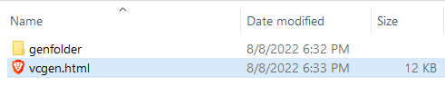
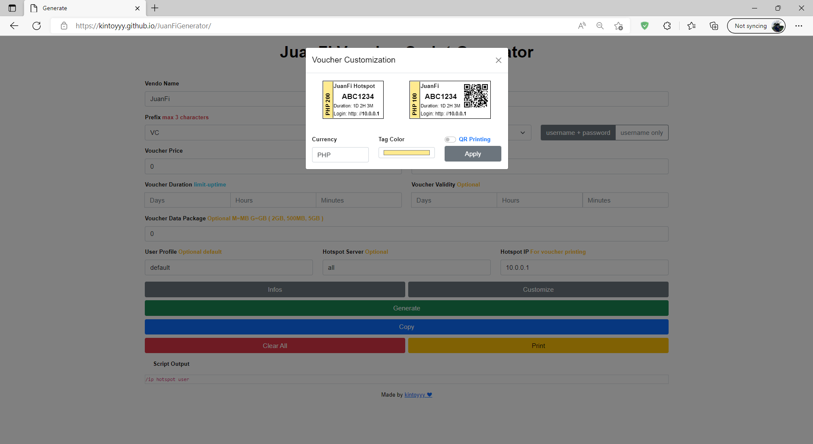

# **JuanFi Voucher Generator**

### **Added:** 
- user + pass & user only option 
- Clear button 
- Voucher color customization 
- Separate Voucher Duration and Validity 
- Custom Currency 
- Generate up to 5000 vouchers
### **Known Issues:**
- user + pass QR voucher not working 
- Need webpage refresh after printing

# **Generate using Github**
##  https://kintoyyy.github.io/JuanFiGenerator/

# **Generate by adding it to your hotspot portal**
### **How to add Voucher Generator in your hotspot portal?**

### 1. Download the [hotspot](/hotspot) folder and extract the files.
> 

### 2. Backup your orignal hotspot files first before adding the voucher generator files.
> 
### 3. Copy and paste the **vcgen.html** and **genfolder** inside the **/hotspot** folder.
> 
## 4. **Done!** 

### 5. You can now access the Generator webpage using your hotspot ip address and placing **/vcgen.html** at the end of it.

    http://hotspot-ip-address/vcgen.html
    http://10.1.0.1/vcgen.html
> 

# **Screenshots**
- Main Page

- Voucher Customization

- printing page

- print settings

> ## **This Voucher Generator Only works for [ivanalayan15/JuanFi](https://github.com/ivanalayan15/JuanFi) system**
> - ### Facebook Community: https://www.facebook.com/groups/1172413279934139
> - JuanFi is an open source system for coinslot integration for mikrotik hotspot
> - Donation is very welcome, you can donate to juanfi system developer.
> - Gcash account: Ivan Julius Alayan 09175425572
> - Paypal account: https://www.paypal.com/paypalme/ivanalayan

    Made by Kintoyyy :)
    Gcash account: Kent R. 09760009422
    FB: @kint.oyyy508
